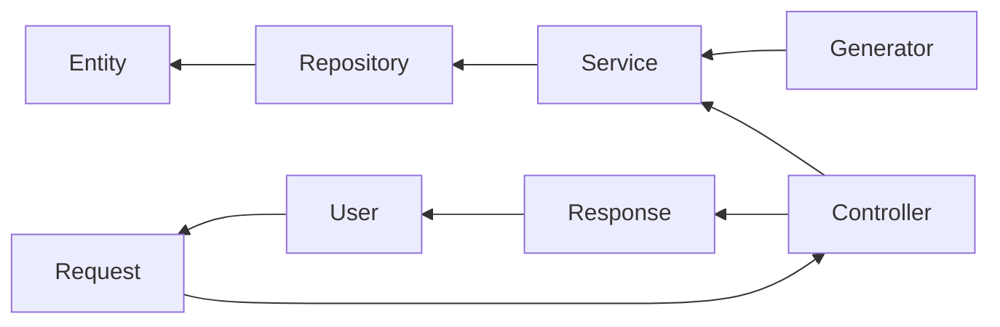

# Binar BEJ Challenge 5


Independent Study batch 5 Binar Academy - Backend Java
Challenge 5 assignment - BinarFud

## Disclaimer
This is not a real-world project; this project is only for educational purposes.

## 📌 Features

- Add product
- Update detail product
- Get product
- Delete product
- Show available product
- Register merchant
- Get merchant
- Update status merchant
- Show open merchant
- Register user
- Get user
- Update user
- Delete user
- Create order
- Invoice Bill PDF
- Get order
- Show all order

## 📥 Getting Started

### Prerequisites

- Java (version 8 or higher)
- Maven
- Git

### Installation

Clone this repository first:
```git
git clone git@github.com:solahkay/binar-bej-challenge-gold.git
```

change the directory to the root of the project:
```git
cd binar-bej-challenge-gold
```

create branch `challenge_5`:
```git
git branch challenge_5
```

switch to branch `challenge_5`:
```git
git switch challenge_5
```

don't forget to pull the code in remote repository:
```git
git pull origin challenge_5
```

and then the project are ready to use!

## 🎇 ERD

[Binar Fud ERD](binarfud-erd.md)

## 🔧 Usage

you can build this project with `maven`:
```maven
mvn clean package
```

and then run the `.jar` file in *target* folder:
```
java -jar target/binar-bej-challenge-gold-0.0.1-SNAPSHOT.jar
```

## 🔗 Workflow


