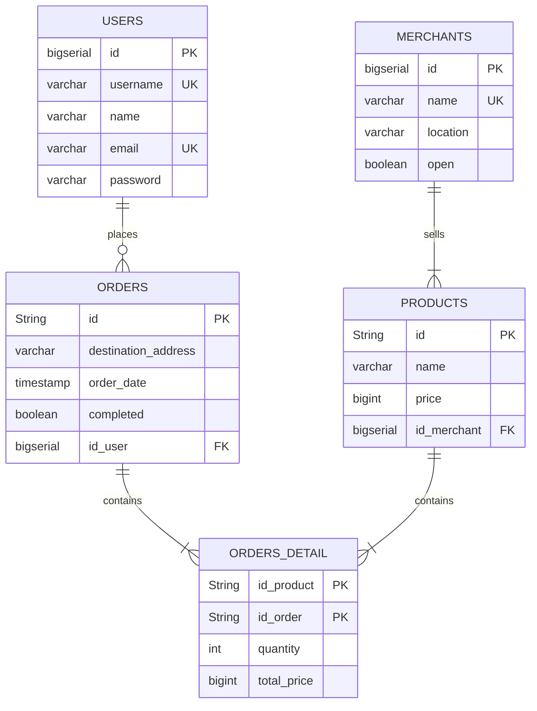

## Entity Relationship Diagram

```mermaid
erDiagram
    USERS {
        bigserial id PK
        varchar username UK
        varchar name
        varchar email UK
        varchar password
    }

    MERCHANTS {
        bigserial id PK
        varchar name UK
        varchar location
        boolean open
    }
    
    PRODUCTS {
        String id PK
        varchar name
        bigint price
        bigserial id_merchant FK
    }
    
    ORDERS {
        String id PK
        varchar destination_address
        timestamp order_date
        boolean completed
        bigserial id_user FK
    }
    
    ORDERS_DETAIL {
        String id_product PK
        String id_order PK
        int quantity
        bigint total_price
    }

    MERCHANTS ||--|{ PRODUCTS : sells
    USERS ||--o{ ORDERS : places
    ORDERS ||--|{ ORDERS_DETAIL : contains
    PRODUCTS ||--|{ ORDERS_DETAIL : contains
    
```
