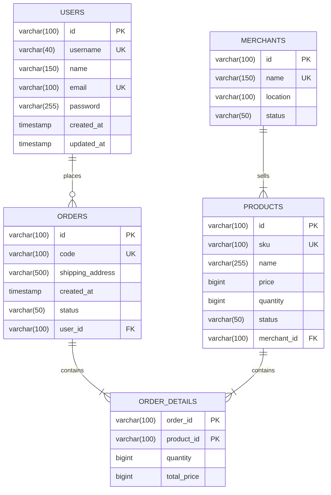

## Entity Relationship Diagram

```mermaid
erDiagram
    USERS {
        varchar(100) id PK
        varchar(40) username UK
        varchar(150) name
        varchar(100) email UK
        varchar(255) password
        timestamp created_at
        timestamp updated_at
    }

    MERCHANTS {
        varchar(100) id PK
        varchar(150) name UK
        varchar(100) location
        varchar(50) status
    }
    
    PRODUCTS {
        varchar(100) id PK
        varchar(100) sku UK
        varchar(255) name
        bigint price
        bigint quantity
        varchar(50) status
        varchar(100) merchant_id FK
    }
    
    ORDERS {
        varchar(100) id PK
        varchar(100) code UK
        varchar(500) shipping_address
        timestamp created_at
        varchar(50) status
        varchar(100) user_id FK
    }
    
    ORDER_DETAILS {
        varchar(100) order_id PK
        varchar(100) product_id PK
        bigint quantity
        bigint total_price
    }

    MERCHANTS ||--|{ PRODUCTS : sells
    USERS ||--o{ ORDERS : places
    ORDERS ||--|{ ORDER_DETAILS : contains
    PRODUCTS ||--|{ ORDER_DETAILS : contains
```
